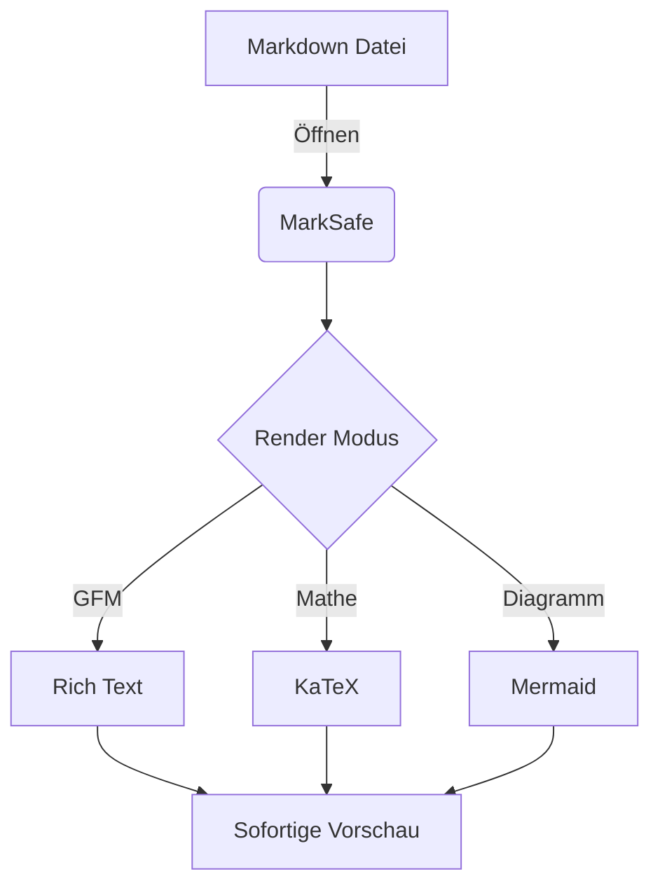

# Sicherer Markdown Editor & Instant Live-Vorschau.

MarkSafe (ehemals MDViewer) ist das ultimative Desktop-Tool für Entwickler. Es kombiniert einen einfachen Editor mit der Geschwindigkeit einer nativen App und reichhaltigen Rendering-Funktionen.

## Warum MarkSafe?
- **Multi-Tab Oberfläche:** Arbeiten Sie an mehreren Dokumenten gleichzeitig, ohne Ihren Desktop zu überladen.
- **Umfangreiche Markdown-Unterstützung:**
    - **GFM:** Volle Unterstützung für GitHub Flavored Markdown inklusive Tabellen, Tasklisten und Fußnoten.
    - **GitHub Alerts:** Nutzen Sie `> [!NOTE]` oder `> [!WARNING]` für gut sichtbare Notizen und Tipps.
    - **Mathematik:** Integriertes **KaTeX** für komplexe mathematische Formeln und wissenschaftliche Notation.
    - **Diagramme:** Native **Mermaid.js** Unterstützung für Flussdiagramme, Sequenzen und Klassendiagramme.

## Native Mermaid.js Unterstützung
Stellen Sie komplexe Workflows oder technische Architekturen direkt in Ihren Dokumenten dar:

## Datenschutz an erster Stelle
Ihre Daten bleiben dort, wo sie hingehören: auf Ihrem Rechner. Links innerhalb der markdown Dateien (z.Bsp bilder) werden erst nach Bestätigung ausgeführt . MarkSafe verfolgt Ihre Nutzung nicht und lädt Ihre Dokumente nicht in Cloud-Dienste hoch.
