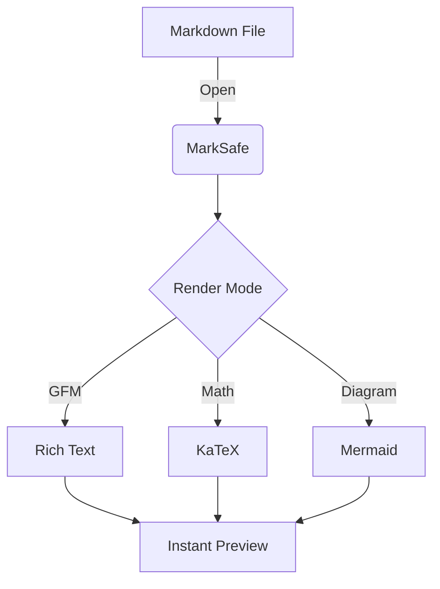

# Secure, powerful Markdown Editor & Instant Preview.

MarkSafe (formerly MDViewer) is the ultimate desktop tool for developers. It combines a clean, simple editor with the speed of a native app and rich rendering capabilities.

## Why MarkSafe?
- **Multi-Tab Interface:** Work with multiple documents simultaneously without cluttering your desktop.
- **Rich Markdown Support:**
    - **GFM:** Full support for GitHub Flavored Markdown including tables, tasklists, and footnotes.
    - **GitHub Alerts:** Use `> [!NOTE]` or `> [!WARNING]` for high-visibility notes and tips.
    - **Math:** Integrated **KaTeX** for complex mathematical expressions and scientific notation.
    - **Diagrams:** Native **Mermaid.js** support for flowcharts, sequences, and class diagrams.

## Native Mermaid.js Support
Showcase complex workflows or technical architectures directly in your documents:

## Privacy First
Your data stays where it belongs: on your machine. MarkSafe does not track your usage or upload your documents to any cloud service.
