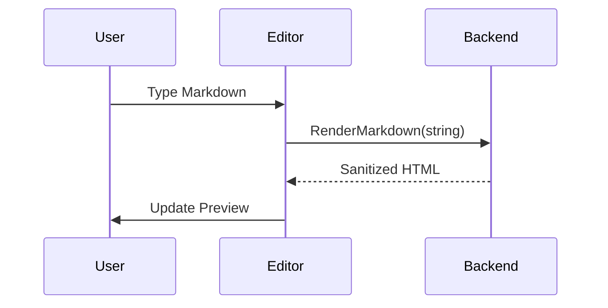

# Comprehensive Markdown Test File

## 1. Text Formatting
**Bold Text**, *Italic Text*, ***Bold & Italic***, ~~Strikethrough~~.
`Inline Code Block` and [Link to Google](https://google.com). 🚀 :sparkles:

> [!NOTE]
> This is a standard note for general information.

> [!TIP]
> Use emojis like :rocket: to make your markdown more expressive!

> [!WARNING]
> External links will now open in your system browser.

> [!CAUTION]
> Be careful with syntax errors in Mermaid diagrams.

## 2. Lists
### Unordered
- Item 1
- Item 2
  - Sub-item A
  - Sub-item B
- Item 3

### Ordered
1. First
2. Second
3. Third

### Task List
- [x] Backend implemented
- [x] Frontend refactored
- [ ] Documentation finished

## 3. Complex Tables
| Feature | Category | Status | Priority | Notes |
| :--- | :--- | :---: | :---: | :--- |
| Markdown Parsing | Core | ✅ | High | Using Goldmark |
| Syntax Highlighting | UI | ✅ | Med | Chroma + Styles |
| Mermaid Diagrams | Visual | ✅ | Med | Mermaid.js |
| Table Styling | GFM | 🎨 | High | Tailored CSS |
| *Long Content* | *Overflow* | ⏳ | Low | Checking wrap behavior in very long table cells to see how the layout handles it |

## 4. Language Gallery (All Requested)

### Bash
```bash
#!/bin/bash
# A simple script to count files
COUNT=$(ls -1 | wc -l)
echo "There are $COUNT files in this directory."
```

### C++
```cpp
#include <iostream>
#include <vector>

int main() {
    std::vector<int> numbers = {1, 2, 3, 4, 5};
    for (int n : numbers) {
        std::cout << "Square of " << n << " is " << n*n << std::endl;
    }
    return 0;
}
```

### Java
```java
public class Test {
    public static void main(String[] args) {
        System.out.println("Java rendering check...");
        for (int i = 0; i < 3; i++) {
            System.out.format("Index: %d
", i);
        }
    }
}
```

### PHP
```php
<?php
$data = ["status" => "success", "code" => 200];
header('Content-Type: application/json');
echo json_encode($data);
?>
```

### SQL
```sql
BEGIN;
UPDATE accounts SET balance = balance - 100 WHERE id = 1;
UPDATE accounts SET balance = balance + 100 WHERE id = 2;
COMMIT;
```

### Makefile
```makefile
.PHONY: build clean

BINARY_NAME=md-viewer

build:
	go build -o $(BINARY_NAME) main.go

clean:
	rm -f $(BINARY_NAME)
```

## 5. Visual Diagrams (Mermaid)


## 6. Mathematical Expressions (KaTeX)
### Inline Math
The Pythagorean theorem: $a^2 + b^2 = c^2$.
The quadratic formula: $x = \frac{-b \pm \sqrt{b^2 - 4ac}}{2a}$

### Block Math
$$
\int_{a}^{b} f(x) \,dx = F(b) - F(a)
$$

$$
\begin{pmatrix}
1 & 0 & 0 \\
0 & 1 & 0 \\
0 & 0 & 1
\end{pmatrix}
$$

## 7. Horizontal Rule
---
EOF
