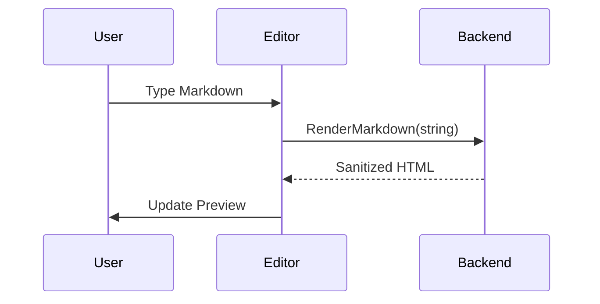

# Comprehensive Markdown Test File

## 1. Text Formatting
**Bold Text**, *Italic Text*, ***Bold & Italic***, ~~Strikethrough~~.
`Inline Code Block` and [Link to Google](https://google.com). 🚀 :sparkles:
Footnotes are supported by the Goldmark renderer.[^1]

> [!NOTE]
> This is a standard note for general information.

> [!TIP]
> Use emojis like :rocket: to make your markdown more expressive!

> [!WARNING]
> External links will now open in your system browser.

> [!CAUTION]
> Be careful with syntax errors in Mermaid diagrams.

## 2. Lists
### Unordered
- Item 1
- Item 2
  - Sub-item A
  - Sub-item B
- Item 3

### Ordered
1. First
2. Second
3. Third

### Task List
- [x] Backend implemented
- [x] Frontend refactored
- [ ] Documentation finished

## 3. Complex Tables
| Feature | Category | Status | Priority | Notes |
| :--- | :--- | :---: | :---: | :--- |
| Markdown Parsing | Core | ✅ | High | Using Goldmark |
| Syntax Highlighting | UI | ✅ | Med | Chroma + Styles |
| Mermaid Diagrams | Visual | ✅ | Med | Mermaid.js |
| Table Styling | GFM | 🎨 | High | Tailored CSS |
| *Long Content* | *Overflow* | ⏳ | Low | Checking wrap behavior in very long table cells to see how the layout handles it |

## 4. Language Gallery (All Requested)

### Bash
```bash
#!/bin/bash
# A simple script to count files
COUNT=$(ls -1 | wc -l)
echo "There are $COUNT files in this directory."
```

### C++
```cpp
#include <iostream>
#include <vector>

int main() {
    std::vector<int> numbers = {1, 2, 3, 4, 5};
    for (int n : numbers) {
        std::cout << "Square of " << n << " is " << n*n << std::endl;
    }
    return 0;
}
```

### Java
```java
public class Test {
    public static void main(String[] args) {
        System.out.println("Java rendering check...");
        for (int i = 0; i < 3; i++) {
            System.out.format("%d ", i);
        }
        System.out.println();
    }
}
```

### PHP
```php
<?php
$data = ["status" => "success", "code" => 200];
header('Content-Type: application/json');
echo json_encode($data);
?>
```

### SQL
```sql
BEGIN;
UPDATE accounts SET balance = balance - 100 WHERE id = 1;
UPDATE accounts SET balance = balance + 100 WHERE id = 2;
COMMIT;
```

### Makefile
```makefile
.PHONY: build clean

BINARY_NAME=md-viewer

build:
	go build -o $(BINARY_NAME) main.go

clean:
	rm -f $(BINARY_NAME)
```

### Go
```go
package main

import "fmt"

func main() {
    nums := []int{1, 2, 3}
    for _, n := range nums {
        fmt.Println("Zahl:", n)
    }
}
```

### TypeScript
```typescript
interface Config {
    theme: "light" | "dark";
    lang: string;
}

const config: Config = { theme: "dark", lang: "de" };
console.log(`Theme ${config.theme}, Sprache ${config.lang}`);
```

### YAML
```yaml
service: marksafe
version: "1.3"
features: [gfm, mermaid, katex]
rendering:
  highlight_style: github-dark
  max_width: 80ch
```

### Zsh
```zsh
#!/bin/zsh
setopt extendedglob
files=(*.{ts,go}(N1))        # zsh-specific glob + modifier
print "Found ${#files} files"
echo $files[@]               # array expansion
```

### Rust
```rust
use std::fmt;

struct Point { x: i32, y: i32 }

impl fmt::Display for Point {
    fn fmt(&self, f: &mut fmt::Formatter) -> fmt::Result {
        write!(f, "({},{})", self.x, self.y)
    }
}

fn main() {
    let p = Point { x: 3, y: 7 };
    println!("Punkt: {}", p);
}
```

### Python
```python
from pathlib import Path

def count_lines(directory: str) -> dict[str, int]:
    lines = {p.name: len(p.read_text().splitlines()) for p in Path(directory).glob("*.md")}
    return dict(sorted(lines.items(), key=lambda item: item[1], reverse=True))

print(count_lines("./docs"))
```

### Swift
```swift
struct Order {
    let id: Int
    var total: Decimal
}

extension Order {
    func withTax(rate: Decimal) -> Decimal {
        total * (Decimal(1) + rate)
    }
}

let order = Order(id: 42, total: Decimal(string: "99.90")!)
print(order.withTax(rate: Decimal(string: "0.19")!))
```

### Kotlin
```kotlin
data class User(val name: String, val email: String)

fun main() {
    val users = listOf(User("Ada", "ada@example.com"), User("Linus", "linus@example.com"))
    users.filter { it.email.endsWith("example.com") }
        .sortedBy { it.name }
        .forEach { println("${it.name}: ${it.email}") }
}
```

### Dockerfile
```dockerfile
FROM golang:1.24-alpine AS builder
WORKDIR /src
COPY go.mod go.sum ./
RUN go mod download
COPY . .
RUN CGO_ENABLED=0 go build -ldflags "-s -w" -o marksafe .

FROM alpine:3.20
RUN adduser -D app
USER app
COPY --from=builder /src/marksafe /usr/local/bin/marksafe
ENTRYPOINT ["marksafe"]
```

### Haskell
```haskell
module Main where

import Data.List (sortOn)

countWords :: String -> Int
countWords = length . words

main :: IO ()
main = do
    let text = "the quick brown fox jumps over the lazy dog"
    print $ sortOn length (words text)
```

### Elixir
```elixir
defmodule Greeter do
  def hello(names) when is_list(names) do
    names
    |> Enum.map(fn name -> "Halló, #{name}!" end)
    |> Enum.join("\n")
  end
end

IO.puts(Greeter.hello(["Ada", "Linus"]))
```

## 5. Visual Diagrams (Mermaid)

```mermaid
sequenceDiagram
    participant User
    participant Editor
    participant Backend
    User->>Editor: Type Markdown
    Editor->>Backend: RenderMarkdown(string)
    Backend-->>Editor: Sanitized HTML
    Editor->>User: Update Preview
```

## 6. Mathematical Expressions (KaTeX)
### Inline Math
The Pythagorean theorem: $a^2 + b^2 = c^2$.
The quadratic formula: $x = \frac{-b \pm \sqrt{b^2 - 4ac}}{2a}$

### Block Math
$$
\int_{a}^{b} f(x) \,dx = F(b) - F(a)
$$

$$
\begin{pmatrix}
1 & 0 & 0 \\
0 & 1 & 0 \\
0 & 0 & 1
\end{pmatrix}
$$

$$ \int_{-\infty}^{\infty} e^{-x^2} \,dx = \sqrt{\pi} $$

## 7. Horizontal Rule
---

## 8. Footnotes

Das Goldmark-Footnote-Extension rendert diesen Verweis am Ende als Fußnote.[^2]

[^1]: Diese Fußnote wird von der Goldmark-Footnote-Extension gerendert (markdown.go:221).
[^2]: Zweite Fußnote zur Abdeckung von Mehrfachverweisen.
